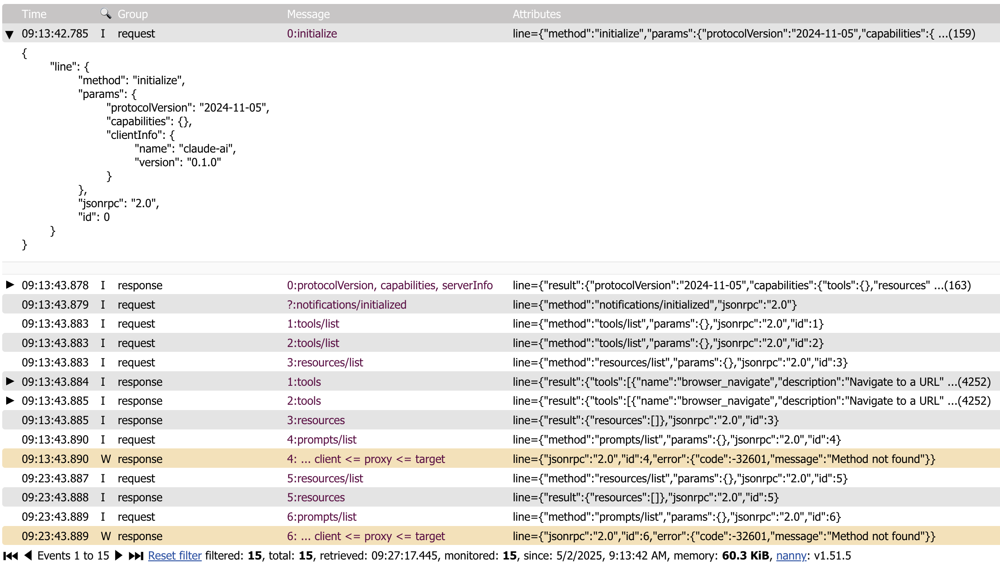
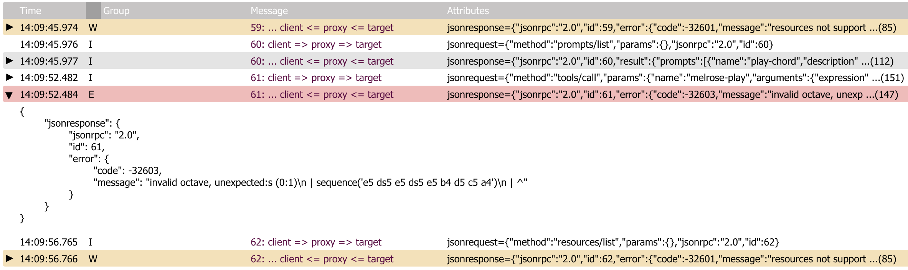

## mcp-log-proxy

`mcp-log-proxy` can be used to see the messages to and from a MCP client and a MCP server using a Web interface.

Currently, it only supports the STDIO interface.



## install

    go install github.com/emicklei/mcp-log-proxy@latest

### usage

`mcp-log-proxy` requires one argument `-command` that contains the full command line for starting the MCP server.

For example, to proxy traffic to the `melrose-mcp` server, the full command is:

    mcp-log-proxy -command melrose-mcp

This example assumes that both tools are available on your execution PATH.

Once the proxy is started, messages can be viewed on `http:/localhost:5656`.

#### optional flags

You can override the Web page title using the `title` flag:

    mcp-log-proxy -command melrose-mcp -title "Melrōse (proxy)"   

You can override the HTTP port(default 5656) using the `port` flag:

    mcp-log-proxy -command melrose-mcp -port 9999

You can override the log file location of the proxy that captures errors in the proxy itself using the `log` flag:

    mcp-log-proxy -command melrose-mcp -log /your/logs/mcp-log-proxy.log

You can set the browser page title using the `title` flag:

    mcp-log-proxy -command melrose-mcp -title "Melrose MCP proxy"

### Claude examples

This example proxies the use of the `melrose-mcp` server.
Locate the binaries to get the correct paths.

    "melrōse": {
      "command": "/Users/emicklei/go/bin/mcp-log-proxy",
      "args": [
        "-command",
        "/Users/emicklei/go/bin/melrose-mcp -log /Users/emicklei/Documents/claude-melrose.log",
        "-log",
        "/Users/emicklei/Documents/claude-melrose-proxy.log",
        "-port",
        "7788",
        "-title",
        "Claude Melrose MCP"
      ]
    },

Proxying the `browsermcp` server.

    "browsermcp": {
      "command": "/Users/emicklei/go/bin/mcp-log-proxy",
      "args": [
        "-command",
        "npx @browsermcp/mcp@latest",
        "-log",
        "/Users/emicklei/Documents/claude-browsermcp-proxy.log",
        "-port",
        "7799",
        "-title",
        "Claude Browser MCP"
      ]
    }

### Goose Example

This example proxies the use of the `melrose-mcp` server.
Locate the binaries to get the correct paths.
```
/Users/emicklei/go/bin/mcp-log-proxy -command /Users/emicklei/go/bin/melrose-mcp -log /Users/emicklei/Library/Logs/goose-melrose.log -port 8888 -title Melrose-MCP
```

### Error information



### Multiple proxies

All running mcp-log-proxy processes will register themselves in `.mcp-log-proxy-instances.json` located in your home directory.

&copy; 2025, https://ernestmicklei.com. MIT License.
